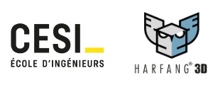
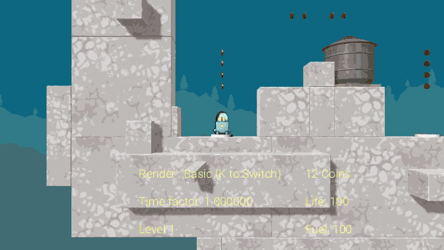

# Astro-Lander Game

## CESI x HARFANG Workshop

Astro-Lander is a game prototype co-created during a 1-day workshop between [CESI Nanterre](https://paris.cesi.fr/) & [Harfang 3D](https://www.harfang3d.com). The game relies on realtime physics to challenge the player on their skills to counterbalance gravity and inertia. 
Astro-Lander is implemented in [Python](https://www.python.org/) :snake:

* All the levels where created by CESI students.
* Some of the game logic was implemented by the students.
* The game is open source and can be re-used for any other purpose.

## If you want to play :video_game:
 - Download the [latest release](https://github.com/harfang3d/game-astro-lander/releases) (look for a file like ` astrolander_xxx.zip`)
 - Unzip it
 - Run `2-run.bat` (or `3-run vr.bat` if you feel lucky and have SteamVR installed with a VR headset)
 - To control the lander (the spaceship with a little :brain: in it) press the arrow keys:
   - :arrow_left: Thrust `left`
   - :arrow_right: Thrust `right`
   - :arrow_left: + :arrow_right: Thrust `up`
 - Get all the coins
 - Reach the homebase (flat cylinder on the ground, looking like a target, facing upward)
 - If your life reach `0`, you die
 - If your fuel reach `0`, you die
 - Press `k` to enable the `AAA` rendering mode (realtime GI and reflections)

## If you want to code :computer:

### Requirements:
 - Python 3 (provided)
 - [Harfang 3.2.4](https://pypi.org/project/harfang/) (provided)
 - VSCode
 - [Harfang Studio](https://www.harfang3d.com/en_US/studio)
 - Blender/Maya (optional)
 
 ### How do install it:
 - clone the repository
 - open the folder in VSCode
 - run it
 
 ### How to edit/create a new level:
 - Install [Harfang Studio](https://www.harfang3d.com/en_US/studio)
 - Run Harfang Studio
 - open the project (`resources/project.prj`)
 - look for the `resources/scenes/levels` folder

## Contributors :red_haired_woman: :man: :bald_woman: :bearded_person:
- AroD117
- Astrofra
- Disketflu
- Evenll
- KindPixel
- Kipixelle
- Kvntn
- LANGLOISGuillaume
- MomoALK
- Scorpheus
